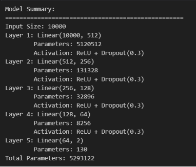
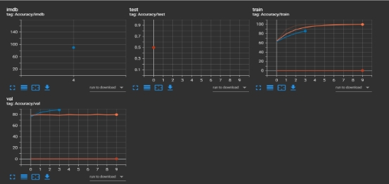
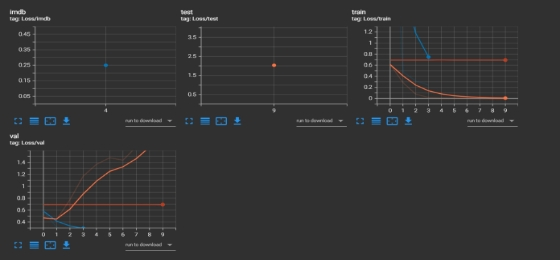
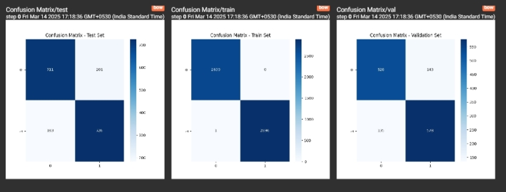
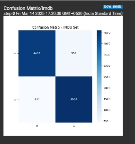
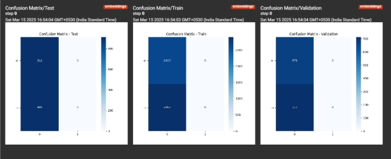
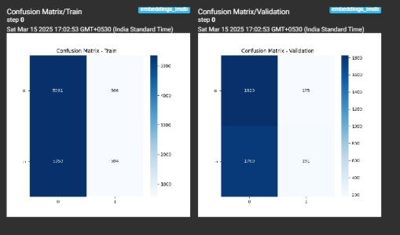
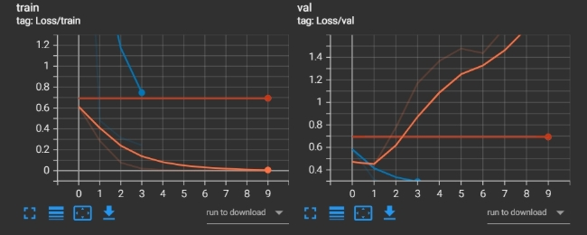
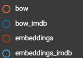

# CS 203 - Software Tools and Techniques for AI 
Assignment - 7 

Shah Harshil Hardik (23110132), Shah Tirth (23110295) 

Link to Github Repo: [Github](https://www.github.com/HarshilShah1804/CS203_Assignment7) 

1. Model Summary: 

   

2. Hyperparameters: 
1. Bag-of-words: 
- max\_features : 10,000 (CountVectorize) 
- Num\_layers = 5 
- Activation = Relu 
- Architecture: (Visible in the image above) 
- Dropout rate: 0.3 
- Learning rate (Training) = 1e-3 
- Learning rate (Fine-Tuning) = 1e-4 
- Epochs = 10 
- Loss\_fn = CrossEntropyLoss 
- Batch\_size (training + fine-tuning) = 64 
2. Embeddings: 
- Num\_layers = 5 
- Activation = Relu 
- Architecture: (Visible in the image above) 
- Dropout rate: 0.3 
- Learning rate (Training) = 1e-3 
- Learning rate (Fine-Tuning) = 1e-4 
- Epochs = 10 
- Loss\_fn = CrossEntropyLoss 
- Model = bert-base-uncased 
- Batch\_size (embeddings) = 16 
- Batch\_size (training + fine-tuning) = 32 
3. Logged Metrics: 
1. Accuracy: 

2. Loss: 

4. Final Evaluation Result:  
   1. Validation Accuracy (Embeddings) = 0.51 
   1. Validation Accuracy (Bag-of-words) = 0.90 
4. Confusion Matrix Visualization: 
1. Bag-of-words (STT2) 

2. Bag-of-words (IMDB) 

   

3. Embeddings (STT 2): 

4. Embeddings (IMDB): 

   

6. Training and Validation loss curves: 

Legend: 

